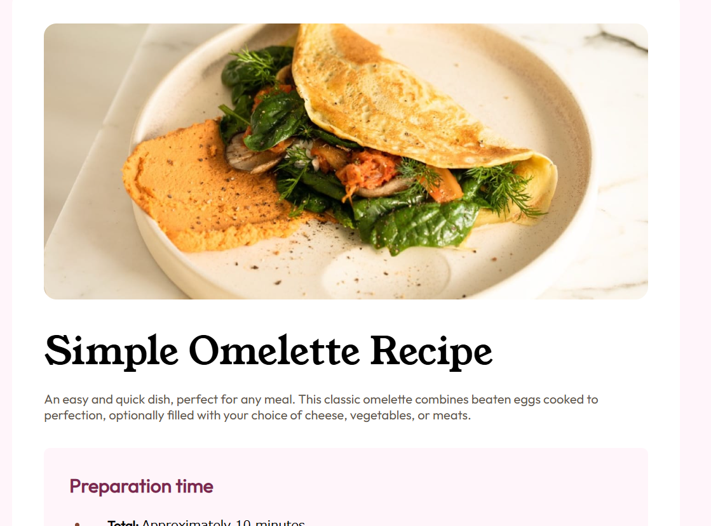

# Frontend Mentor - Recipe page solution

This is a solution to the [Recipe page challenge on Frontend Mentor](https://www.frontendmentor.io/challenges/recipe-page-KiTsR8QQKm). Frontend Mentor challenges help you improve your coding skills by building realistic projects. 

## Table of contents

- [Overview](#overview)
  - [The challenge](#the-challenge)
  - [Screenshot](#screenshot)
  - [Links](#links)
- [My process](#my-process)
  - [Built with](#built-with)
  - [What I learned](#what-i-learned)
  - [Continued development](#continued-development)
  - [Useful resources](#useful-resources)
- [Author](#author)
- [Acknowledgments](#acknowledgments)

**Note: Delete this note and update the table of contents based on what sections you keep.**

## Overview

### Screenshot



Add a screenshot of your solution. The easiest way to do this is to use Firefox to view your project, right-click the page and select "Take a Screenshot". You can choose either a full-height screenshot or a cropped one based on how long the page is. If it's very long, it might be best to crop it.

Alternatively, you can use a tool like [FireShot](https://getfireshot.com/) to take the screenshot. FireShot has a free option, so you don't need to purchase it. 

Then crop/optimize/edit your image however you like, add it to your project, and update the file path in the image above.

**Note: Delete this note and the paragraphs above when you add your screenshot. If you prefer not to add a screenshot, feel free to remove this entire section.**

### Links

- Solution URL: [Add solution URL here](https://www.frontendmentor.io/solutions/recipe-page-eeNAm4l0ZC)
- Live Site URL: [Add live site URL here](https://recipe-page-rho-pink.vercel.app/)

## My process

### Built with

- Semantic HTML5 markup
- CSS custom properties
- Flexbox
- CSS Grid
- Mobile-first workflow

**Note: These are just examples. Delete this note and replace the list above with your own choices**

### What I learned

Use this section to recap over some of your major learnings while working through this project. Writing these out and providing code samples of areas you want to highlight is a great way to reinforce your own knowledge.

To see how you can add code snippets, see below:

```html
<table>
 <tr>
    <td>Calories</td>
    <td class="value">277kcal</td>
  </tr>
  <tr>
    <td>Carbs</td>
    <td class="value">0g</td>
  </tr>
  <tr>
    <td>Protein</td>
    <td class="value">20g</td>
  </tr>
  <tr>
    <td>Fat</td>
    <td class="value">22g</td>
  </tr>
</table>
```
```css
table {
    width: 100%;
    border-collapse: collapse;
    font-family: "Outfit";
    font-size: 16px;
    font-weight: 400;
    color: hsl(30, 10%, 34%);
}

td {
    padding: 8px 0;
    border-bottom: 1px solid rgb(228, 228, 228);
}

.value {
    font-weight: bold;
    color: #7b4a36;
}
```

If you want more help with writing markdown, we'd recommend checking out [The Markdown Guide](https://www.markdownguide.org/) to learn more.

**Note: Delete this note and the content within this section and replace with your own learnings.**

### Continued development


### Useful resources


## Author

- GitHub - [mi8bi](https://github.com/mi8bi)
- Frontend Mentor - [@mi8bi](https://www.frontendmentor.io/profile/mi8bi)

## Acknowledgments
